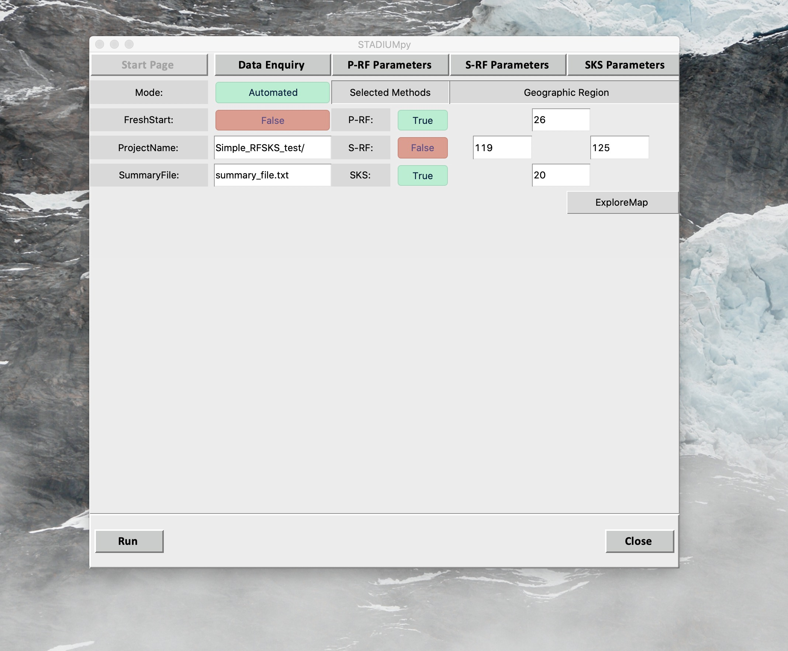
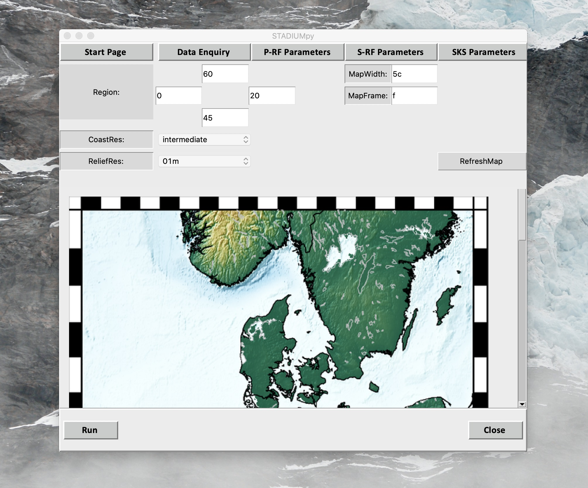

## Preview

## Installation Steps

- Create Environment
`conda create -n stadiumpy python=3.7`

- Activate Environment and install packages
1. `conda install -c conda-forge obspy=1.1.0`

2. `conda install -c conda-forge pygmt=0.1.2=py37hc8dfbb8_0`

3. `conda install -c conda-forge shapely=1.7.0=py37hfcf0db4_3`

4. `conda install -c conda-forge cartopy=0.18.0=py37h08e9697_0`

5. `conda install -c conda-forge fortran-compiler`

6. `pip install obspyh5`

7. `conda install -c conda-forge tqdm=4.48.2=pyh9f0ad1d_0`

8. `pip install rf`

9. `pip install splitwavepy`

### Export environment
`conda env export --name stadiumpy > stadiumpy_env.yml`
